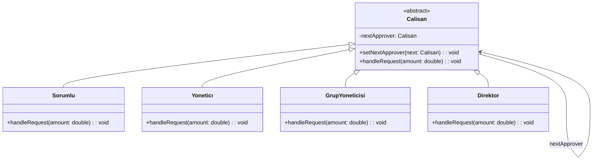

### **Genel Bakış**
Chain of Responsibility (Sorumluluk Zinciri) tasarım deseni, bir isteğin bir dizi nesne arasında sırayla iletilmesini sağlayan bir davranışsal tasarım desenidir. Bu desen, bir isteğin hangi nesne tarafından işleneceğini önceden bilmek yerine, isteği zincir boyunca bir sonraki nesneye ileterek karar verir. Bu, gevşek bağlı (loosely coupled) bir yapı sunar ve sistemin esnekliğini artırır.

### **Kullanım Alanları**
- Onay akışları (ör. finansal talepler, izin süreçleri)
- Hata işleme mekanizmaları
- Sorumlulukların farklı seviyelerde ele alındığı sistemler
- İsteklerin dinamik olarak farklı işlemciler tarafından ele alınması gereken durumlar

### **Uygulama Adımları**
1. **Soyut Sınıf veya Arayüz Tanımlayın**: Tüm işlemciler için ortak bir arayüz veya soyut sınıf oluşturun. Bu sınıf, isteği işlemek için bir metot ve bir sonraki işlemciyi tutacak bir referans içerir.
2. **Concrete (Somut) İşlemciler Oluşturun**: Soyut sınıfı veya arayüzü uygulayan sınıflar oluşturun. Her sınıf, kendi sorumluluk alanına göre isteği işler ve gerekirse bir sonraki işlemciye iletir.
3. **Zinciri Oluşturun**: İşlemcileri birbirine bağlayarak bir zincir oluşturun. Her işlemci, kendisinden sonraki işlemciyi referans olarak tutar.
4. **İstek Gönderin**: İstek, zincirin ilk işlemcisine gönderilir ve zincir boyunca iletilir.

### **UML Diyagramı**
Aşağıdaki UML diyagramı, verilen örneğe uygun olarak hazırlanmıştır.

### **Avantajlar**
1. **Gevşek Bağlılık**: İşlemciler birbirine sıkı sıkıya bağlı değildir, bu da sistemin esnekliğini artırır.
2. **Kolay Genişletilebilirlik**: Yeni işlemciler kolayca eklenebilir veya mevcut işlemcilerin sırası değiştirilebilir.
3. **Sorumluluk Ayrımı**: Her işlemci yalnızca kendi sorumluluk alanıyla ilgilenir.

### **Dezavantajlar**
1. **Zincirin Uzunluğu**: Çok uzun bir zincir, performans sorunlarına neden olabilir.
2. **Hatalı Yapılandırma**: Eğer zincir yanlış yapılandırılırsa, istek hiçbir işlemci tarafından ele alınamayabilir.
3. **Debug Zorluğu**: Zincir boyunca isteğin nasıl ilerlediğini takip etmek zor olabilir.

---

Bu açıklamalar ve UML diyagramı, Chain of Responsibility tasarım desenini ve örnekteki onay akışını açıkça ifade etmektedir.