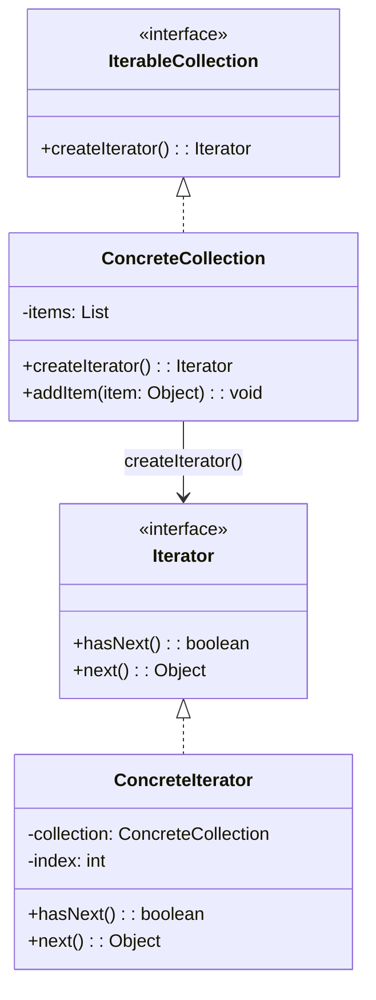
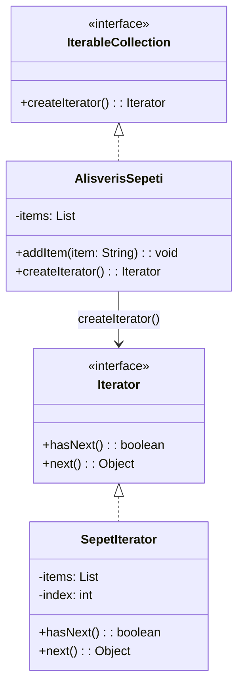

### **Genel Bakış**
Iterator (Yinelenebilir) tasarım deseni, bir koleksiyonun elemanları üzerinde sıralı bir şekilde gezinmek için kullanılan bir davranışsal tasarım desenidir. Bu desen, koleksiyonların iç detaylarını açığa çıkarmadan, elemanlarına erişim sağlar. Java'da bu desen, genellikle `Iterator` arayüzü ve `Iterable` arayüzü ile uygulanır.

Foreach döngüsü gibi yapılar, arkaplanda bu deseni kullanır. Eğer kendi koleksiyon sınıfınızı oluşturuyorsanız ve bu sınıfın foreach gibi yapılarla çalışmasını istiyorsanız, bu deseni uygulamanız gerekir.

---

### **Kullanım Alanları**
- Koleksiyonlar veya diziler üzerinde gezinmek için standart bir yol sağlamak.
- Koleksiyonun iç yapısını gizlemek.
- Farklı türdeki koleksiyonlar üzerinde gezinmeyi birleştirmek.

---

### **Uygulama Adımları**
1. **Iterator Arayüzü Tanımlayın**: Koleksiyonun elemanları üzerinde gezinmek için gerekli metotları (`hasNext()`, `next()`) içeren bir arayüz oluşturun.
2. **Concrete Iterator Sınıfı Oluşturun**: Iterator arayüzünü uygulayan bir sınıf oluşturun. Bu sınıf, koleksiyonun elemanlarını dolaşmak için gerekli mantığı içerir.
3. **Koleksiyon Arayüzü Tanımlayın**: Koleksiyonun bir iterator döndürmesini sağlayan bir metot içeren arayüz oluşturun.
4. **Concrete Koleksiyon Sınıfı Oluşturun**: Koleksiyon arayüzünü uygulayan sınıfı oluşturun. Bu sınıf, kendi iterator nesnesini döndürür.
5. **Kullanım**: Koleksiyon sınıfı üzerinden iterator nesnesi alınır ve elemanlar üzerinde gezinilir.

---

### **UML Diyagramı**

---

### **Avantajlar**
1. **Standartlaştırılmış Gezinme**: Koleksiyonun iç yapısı bilinmeden elemanlar üzerinde gezinilebilir.
2. **Gevşek Bağlılık**: Koleksiyon ve gezinme mantığı birbirinden ayrılmıştır.
3. **Farklı Koleksiyonlar için Ortak Yapı**: Farklı türde koleksiyonlar aynı yöntemle gezilebilir.

---

### **Dezavantajlar**
1. **Ekstra Kod**: Küçük projelerde gereksiz karmaşıklık yaratabilir.
2. **Performans**: Büyük koleksiyonlarda iterator nesnesi oluşturmak ek maliyet getirebilir.

---
## Örnek Uygulama Alışveriş Sepeti UML diyagramı

