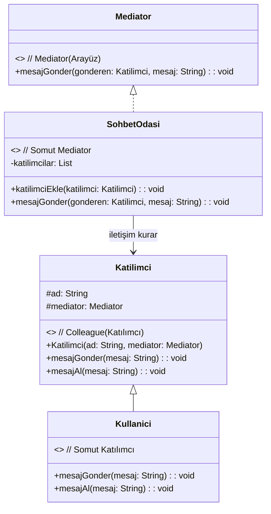

### **Genel Bakış**
**Mediator (Ara Bulucu) Tasarım Deseni**, birbiriyle etkileşimde bulunan nesneler arasındaki doğrudan iletişimi ortadan kaldırarak, bu iletişimi bir merkezi sınıf (mediator) üzerinden yönetmeyi sağlar. Bu desen, nesneler arasında gevşek bağlı (loosely coupled) bir yapı oluşturur ve sistemin karmaşıklığını azaltır.

Bu desenin amacı, birden fazla nesne arasındaki ilişkileri ve iletişimleri organize etmek, böylece nesnelerin birbirine bağımlılığını (tightly coupled) azaltmak ve daha genişletilebilir bir yapı oluşturmaktır.

---

### **Kullanım Alanları**
- Birbirleriyle sürekli etkileşimde olan nesnelerin olduğu durumlarda (örneğin, chat uygulamaları, uçakların iniş-kalkış koordinasyonu).
- Nesneler arasındaki karmaşık ilişkileri merkezi bir yerden yönetmek istendiğinde.
- Nesnelerin birbiriyle doğrudan referans vermesinin istenmediği durumlarda.

---

### **Uygulama Adımları**
1. **Mediator Arayüzü Tanımlayın**:
    - İlgili nesneler arasındaki iletişimi yönetecek bir arayüz oluşturun. Bu arayüz, iletişim için gerekli metotları tanımlar.

2. **Concrete Mediator (Somut Ara Bulucu) Sınıfını Oluşturun**:
    - Mediator arayüzünü uygulayan bir sınıf oluşturun. Bu sınıf, nesneler arasındaki iletişimi ve organizasyonu yönetir.

3. **Colleague (Katılımcı) Arayüzü Tanımlayın**:
    - Mediator ile iletişim kuracak nesnelerin ortak özelliklerini tanımlayan bir arayüz oluşturun.

4. **Concrete Colleague (Somut Katılımcı) Sınıflarını Oluşturun**:
    - Colleague arayüzünü uygulayan sınıflar oluşturun. Bu sınıflar, mediator ile iletişim kurar ve mediator üzerinden diğer nesnelere mesaj gönderir.

5. **Kullanım**:
    - Mediator sınıfı, katılımcılar arasındaki iletişimi yönetir ve mesajları yönlendirir.

---

### **UML Diyagramı**

---

### **Avantajlar**
1. **Gevşek Bağlılık**:
    - Nesneler birbirine doğrudan referans vermez, iletişim mediator üzerinden sağlanır.
2. **Daha Az Karmaşıklık**:
    - Nesneler arasındaki karmaşık ilişkiler merkezi bir yerden yönetilir.
3. **Kolay Bakım ve Genişletilebilirlik**:
    - Yeni nesneler eklemek veya mevcut nesneleri değiştirmek daha kolaydır.

---

### **Dezavantajlar**
1. **Tek Nokta Hatası (Single Point of Failure)**:
    - Tüm iletişim mediator üzerinden geçtiği için, mediator sınıfındaki bir hata tüm sistemi etkileyebilir.
2. **Mediator Karmaşıklığı**:
    - Çok fazla işlev mediatora yüklendiğinde, mediator sınıfı karmaşık hale gelebilir.

---