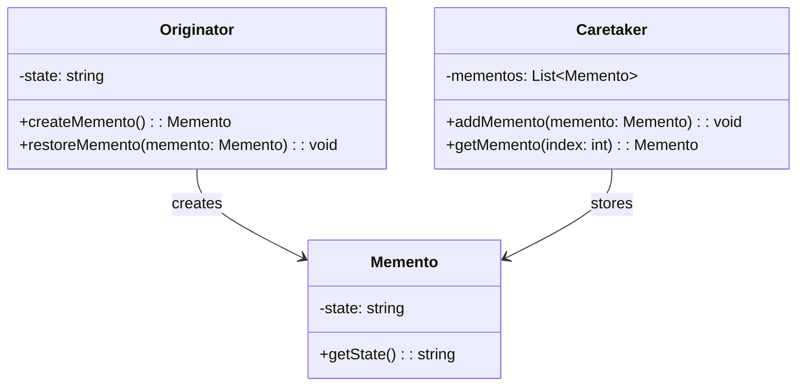
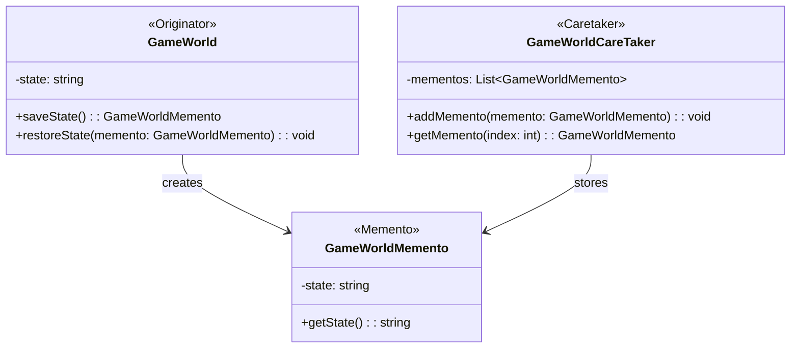

### **Memento Tasarım Deseni**

#### **Genel Bakış**
Memento tasarım deseni, Behavioral (Davranışsal) tasarım desenleri grubunda yer alır. Bu desen, bir nesnenin belirli bir zamandaki durumunu (state) saklamak ve gerektiğinde bu duruma geri dönebilmek için kullanılır. Memento, nesnenin iç durumunu dışarıya açmadan saklamayı sağlar ve böylece nesnenin kapsülleme (encapsulation) ilkesi korunur.

---

#### **Kullanım Alanları**
1. **Undo/Redo İşlemleri**: Kullanıcıların yaptıkları işlemleri geri alabilmesi veya tekrarlayabilmesi gereken uygulamalarda.
2. **Oyunlar**: Oyunun belirli bir anını kaydetmek ve gerektiğinde bu kaydedilen duruma geri dönmek için.
3. **Veri Saklama**: Karmaşık nesnelerin geçici durumlarını saklayarak daha sonra geri yükleme gereksinimi olan uygulamalarda.
4. **Sistem Durumları**: Sistemlerin veya uygulamaların belirli bir çalışma durumu kaydedilerek geri yüklenmesi gereken durumlarda.

---

#### **Uygulama Adımları**
1. **Originator (Kaynak Sınıf)**:
    - Durumu saklanacak olan nesnedir.
    - Memento nesnesi oluşturur ve mevcut durumunu bu nesneye kaydeder.
    - Daha önce kaydedilmiş bir durumu geri yükleyebilir.

2. **Memento (Hafıza Sınıfı)**:
    - Originator sınıfının durumunu saklar.
    - Saklanan duruma dışarıdan erişim sağlanmaz; yalnızca Originator sınıfı bu verilere erişebilir.

3. **Caretaker (Koruyucu Sınıf)**:
    - Memento nesnelerini güvenli bir şekilde saklar.
    - Saklanan durumu değiştirmez veya doğrudan kullanmaz, yalnızca geri yükleme işlemi için Originator sınıfına iletir.

---

#### **UML Diyagramı**

---

#### **Avantajlar**
1. **Geri Al (Undo) İşlevselliği**: Kullanıcıların işlemleri geri almasına veya önceki bir duruma dönmesine olanak tanır.
2. **Kapsülleme (Encapsulation)**: Nesnenin iç durumu dış dünyadan gizlenir, yalnızca Memento ve Originator arasında paylaşılır.
3. **Esneklik**: Karmaşık nesnelerin durumlarını kolayca saklayıp geri yüklemek mümkündür.

---

#### **Dezavantajlar**
1. **Yüksek Bellek Kullanımı**: Çok sayıda durum saklanırsa, bellekte büyük bir yük oluşturabilir.
2. **Performans Sorunları**: Durumun sık sık saklanması ve geri yüklenmesi performansı olumsuz etkileyebilir.
3. **Sınırlı Erişim**: Memento'nun içeriği yalnızca Originator tarafından kullanılabilir, bu da bazen karmaşıklığı artırabilir.

---

Bu tasarım deseni, özellikle oyunlar veya geri al/ileri al işlemleri gerektiren uygulamalarda oldukça faydalıdır. Örneğin, bir oyunda oyuncunun ilerlemesini kaydedip gerektiğinde bu kayda geri dönmesi için kullanılabilir.
## Uygulama Oyun Örneği UML Diyagramı

