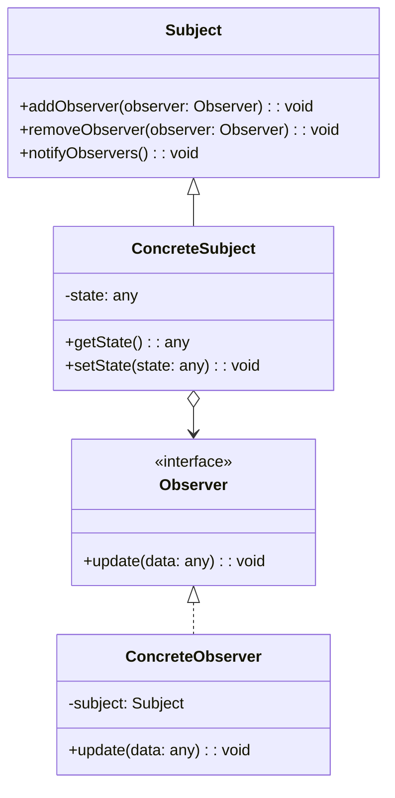
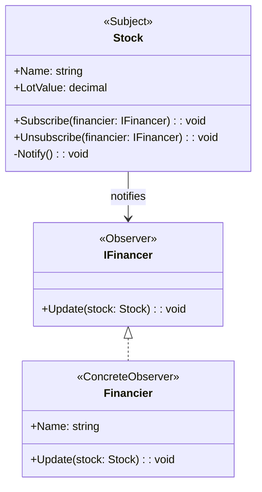

# Observer Design Pattern

## **Genel Bakış**
Observer tasarım deseni, bir nesnenin durumu değiştiğinde bu değişiklikten diğer bağlı nesneleri otomatik olarak haberdar eden bir yapıdır. Bu desen, bir nesne (subject) ile bu nesneyi gözlemleyen diğer nesneler (observers) arasındaki ilişkiyi kurar. Subject üzerindeki herhangi bir değişiklik, bağlı olan observer nesnelerine bildirilir. Bu, "publish-subscribe" modeline benzer bir davranış sergiler.

---

## **Kullanım Alanları**
- **Gerçek Zamanlı Bildirimler**: Örneğin, borsa uygulamalarında hisse senedi fiyatlarındaki değişikliklerin yatırımcılara bildirilmesi.
- **GUI Uygulamaları**: Kullanıcı arayüzünde bir bileşenin durum değişikliği diğer bileşenleri etkiliyorsa.
- **Oyunlar**: Oyuncu hareketlerinin diğer oyunculara yansıtılması.
- **Event-Driven Sistemler**: Bir olayın gerçekleştiğinde bağlı sistemlere bildirim gönderilmesi.

---

## **Uygulama Adımları**
1. **Subject (Gözlemlenen)**: Gözlemlenen nesneyi tanımlar. Observer nesnelerini eklemek, kaldırmak ve güncellemek için metotlar içerir.
2. **Observer (Gözlemci)**: Subject'i gözlemleyen nesneleri tanımlar. Subject'ten gelen bildirimleri alır.
3. **ConcreteSubject**: Subject'in somut bir uygulamasıdır. Durum değişikliklerini takip eder ve observer'lara bildirir.
4. **ConcreteObserver**: Observer arayüzünü uygular ve subject'ten gelen bildirimlere tepki verir.
5. **Client**: Subject ve Observer nesnelerini oluşturur ve ilişkilendirir.

---

## **UML Diyagramı**

---

## **Avantajlar**
1. **Gevşek Bağlılık**: Subject ve Observer arasında düşük bağımlılık sağlar. Observer'lar kolayca eklenebilir veya kaldırılabilir.
2. **Dinamik Güncellemeler**: Subject üzerinde bir değişiklik olduğunda tüm observer'lar otomatik olarak bilgilendirilir.
3. **Kodun Yeniden Kullanılabilirliği**: Observer'lar ve subject'ler birbirinden bağımsız çalıştığı için kodun farklı bölümleri yeniden kullanılabilir.

---

## **Dezavantajlar**
1. **Performans Sorunları**: Çok sayıda observer olduğunda, subject'in bunları güncellemesi zaman alabilir.
2. **Komplekslik**: Observer'ların yönetimi karmaşık hale gelebilir, özellikle çok fazla subject ve observer ilişkisi varsa.
3. **Döngüsel Bağımlılık Riski**: Yanlış tasarlanmış bir sistemde subject ve observer arasında döngüsel bağımlılık oluşabilir.

---

Observer tasarım deseni, sistemin bileşenleri arasında gevşek bir bağ kurarak genişletilebilirlik ve modülerlik sağlar. Örneğin, bir borsa uygulamasında, hisse senedi fiyatlarındaki değişikliklerden yatırımcılar anında haberdar olabilir. Yeni bir yatırımcı eklendiğinde, bu yatırımcı sadece observer listesine eklenir ve mevcut sistemde başka bir değişiklik gerekmez.
## Hisse Stok Observer UML diyagramı

