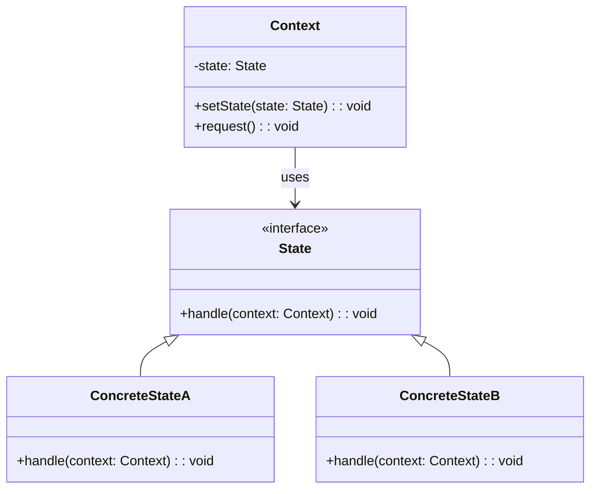
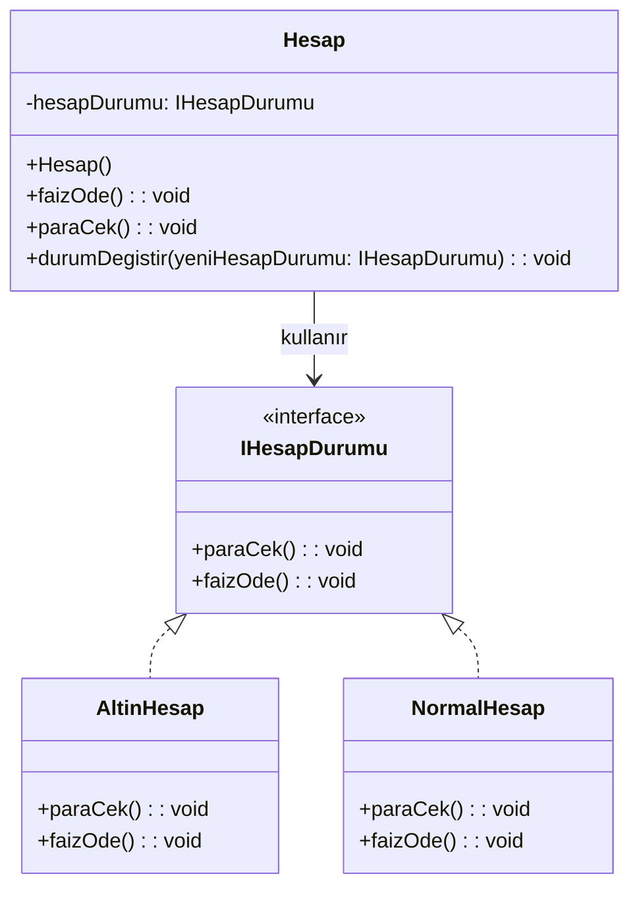

### **State Tasarım Deseni**

#### **Genel Bakış**
State tasarım deseni, nesnenin iç durumundaki değişikliklere göre çalışma zamanında farklı davranışlar sergilemesini sağlar. Bu desen, nesnenin duruma bağlı olarak farklı fonksiyonellikler sunmasını mümkün kılar ve bu durumları (state) birbirinden bağımsız olarak yönetir. **State Pattern**, Open/Closed Principle'a uygun bir yapı sunar; yani yeni bir durum eklemek mevcut kodu değiştirmeden mümkündür.

---

#### **Kullanım Alanları**
1. **Duruma Bağlı Davranışlar**: Nesnelerin durumlarına göre farklı davranışlar sergilemesi gereken durumlarda.
2. **Oyunlar**: Oyuncunun "koşma", "zıplama", "hasar alma" gibi farklı durumlarını yönetmek için.
3. **Finansal Sistemler**: Kredi kartı, hesap durumu gibi özelliklerin dinamik olarak değiştiği alanlarda.
4. **Durum Yönetimi**: Karmaşık if-else veya switch-case yapılarının yerine daha temiz ve genişletilebilir bir yapı gerektiğinde.

---

#### **Uygulama Adımları**
1. **State Arayüzü**:
    - Tüm durumlar için ortak davranışları tanımlar.
    - Örneğin, `handle()` gibi bir metot içerir.

2. **Concrete States (Somut Durumlar)**:
    - Nesnenin farklı durumlarını temsil eden sınıflardır.
    - Her bir durum, `State` arayüzünü uygular ve ilgili davranışı tanımlar.

3. **Context (Bağlam)**:
    - Durumlara göre davranış sergileyen nesnedir.
    - Mevcut durumu (state) referans olarak tutar ve bu duruma göre davranışlarını delegasyon yoluyla gerçekleştirir.

---

#### **UML Diyagramı**

---

#### **Avantajlar**
1. **Kodun Temizliği**: İf-else veya switch-case yapılarından kurtulup daha temiz ve genişletilebilir bir yapı sağlar.
2. **Open/Closed Principle Uyumu**: Yeni durumlar eklemek, mevcut kodu değiştirmeden mümkündür.
3. **Davranışların Ayrıştırılması**: Her bir durumun (state) davranışı ayrı bir sınıfta tanımlanarak kodun okunabilirliği artırılır.

---

#### **Dezavantajlar**
1. **Sınıf Sayısında Artış**: Her bir durum için ayrı bir sınıf tanımlandığından, sınıf sayısı artabilir.
2. **Basit Senaryolar İçin Fazla Karmaşık**: Küçük projelerde veya az sayıda durum içeren sistemlerde gereksiz karmaşıklığa neden olabilir.

---

### **Örnek Uygulama Açıklaması**
Kredi kartı örneğinde:
- **State Arayüzü**: Kredi kartı durumları için ortak davranışları tanımlar (örneğin, faiz hesaplama).
- **Concrete States**:
    - **StandardState**: Yeni açılmış kredi kartı için standart davranışlar.
    - **BlacklistedState**: Borç ödenmediğinde kara listeye alınan kredi kartı için davranışlar.
    - **PremiumState**: Borçlar düzenli ödendiğinde premium özellikler sunan kredi kartı için davranışlar.
- **Context**: Kredi kartı nesnesi, mevcut durumu referans olarak tutar ve davranışlarını bu duruma göre sergiler.
## Örnek Uygulama UML diyagramı
