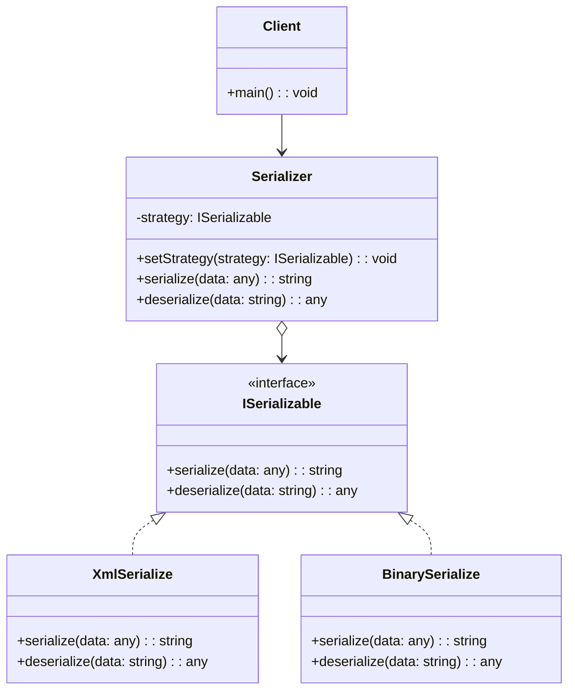

# Strategy Design Pattern

## **Genel Bakış**
Strategy tasarım deseni, bir işlemi birden fazla şekilde gerçekleştirmek gerektiğinde kullanılır. Bu desen, bir işlemin farklı versiyonlarını (stratejilerini) birbirinden bağımsız olarak tanımlamayı ve gerektiğinde bu stratejiler arasında dinamik olarak seçim yapmayı sağlar. Stratejiler bir arayüz ya da soyut sınıf üzerinden tanımlanır ve bu sayede yeni stratejiler kolayca eklenebilir.

---

## **Kullanım Alanları**
- Bir işlemi birden fazla yöntemle gerçekleştirmek gerektiğinde (örneğin, farklı serileştirme yöntemleri: XML, Binary, JSON).
- İşlemleri koşullara göre dinamik olarak değiştirme ihtiyacı olduğunda.
- Kodun esnekliğini artırmak ve yeni davranışlar eklerken mevcut kodu değiştirme ihtiyacını azaltmak için.
- Farklı algoritmaların aynı işi yaptığı durumlarda.

---

## **Uygulama Adımları**
1. **Strategy Arayüzü**: Tüm stratejilerin ortak davranışlarını tanımlayan bir arayüz ya da soyut sınıf oluşturulur.
2. **Concrete Strategies**: Farklı stratejiler bu arayüzden türetilerek tanımlanır (örneğin, `XmlSerialize`, `BinarySerialize`).
3. **Context (Strategy Kullanıcı)**: Stratejiyi kullanan sınıf oluşturulur (örneğin, `Serializer`). Bu sınıf, strateji nesnesini alır ve onun üzerinden işlemleri gerçekleştirir.
4. **Client**: İlgili stratejiyi seçip context sınıfına iletir.

---

## **UML Diyagramı**

---

## **Avantajlar**
1. **Esneklik**: Yeni bir strateji eklemek kolaydır. Mevcut kodda değişiklik yapmadan yalnızca yeni bir sınıf eklenir.
2. **Kodun Modülerliği**: Farklı stratejiler birbirinden bağımsızdır ve ayrı ayrı yönetilebilir.
3. **Açık/Kapalı İlkesi**: Yeni davranışlar eklenirken mevcut kod değiştirilmez.
4. **Dinamik Davranış Değişikliği**: Çalışma zamanında strateji değiştirilebilir.

---

## **Dezavantajlar**
1. **Artan Sınıf Sayısı**: Her strateji için ayrı bir sınıf tanımlanması gerekir, bu da sınıf sayısını artırabilir.
2. **Yönetim Karmaşıklığı**: Çok fazla strateji olduğunda, stratejilerin yönetimi zorlaşabilir.
3. **Strateji Seçimi**: Uygun stratejinin seçimini genellikle istemci yapar, bu da istemci tarafında ek bir sorumluluk yaratabilir.

---

Bu örnek, Strategy tasarım deseninin temel kullanımını ve avantajlarını gösterir. Örneğin, bir serileştirme işlemi için XML, Binary veya JSON yöntemlerinden birini seçmek gerektiğinde, Strategy deseni sayesinde bu işlemler kolayca yapılandırılabilir ve genişletilebilir.