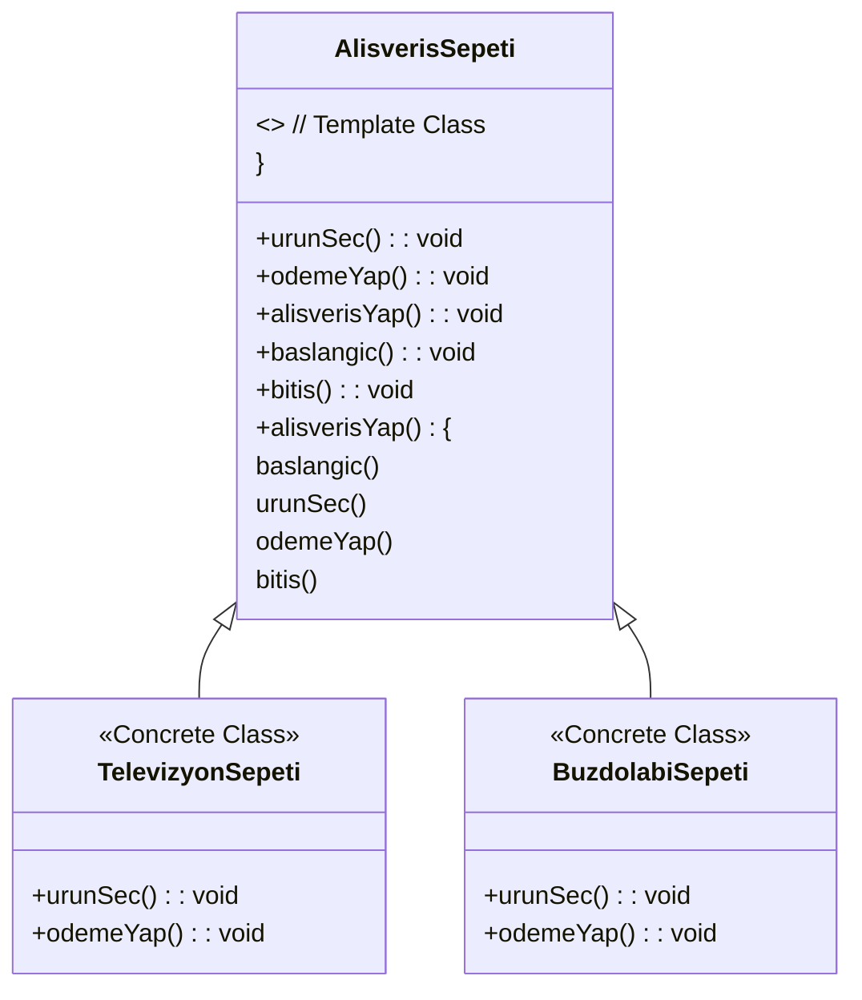

### **Template Design Pattern**

---

#### **Genel Bakış**
Template Design Pattern, bir algoritmanın iskeletini (şablonunu) tanımlayan ve algoritmanın bazı adımlarını alt sınıflar tarafından özelleştirilebilir hale getiren bir tasarım desenidir. Şablon, bir işlemin genel akışını belirlerken, değişken adımlar alt sınıflar tarafından uygulanır. Bu desen, kod tekrarını önler ve süreçlerin kolayca genişletilebilir ve sürdürülebilir olmasını sağlar.

---

#### **Kullanım Alanları**
- **Algoritmik Akışlar**: Bir algoritmanın genel akışı sabit, ancak bazı adımları değişken olduğunda.
- **Kod Tekrarını Önlemek**: Farklı sınıflar arasında ortak bir akış varsa.
- **Standartlaştırma**: Birden fazla sınıfta aynı süreçlerin farklı varyasyonlarının uygulanmasını sağlamak.
- **Örnek Senaryolar**:
    - Ödeme süreçleri (örneğin, kredi kartı ve nakit ödeme).
    - Veri okuma ve yazma işlemleri (örneğin, XML ve JSON formatları).
    - Oyunların farklı seviyeleri için ortak oyun mekanikleri.

---

#### **Uygulama Adımları**
1. **Abstract Class (Soyut Sınıf)**:
    - Şablon bir sınıf oluşturulur.
    - Genel akışın sabit kısımları bu sınıfta uygulanır.
    - Değişken adımlar `abstract` metotlar olarak tanımlanır.
2. **Concrete Classes (Somut Sınıflar)**:
    - Soyut sınıftan türeyen sınıflar, değişken adımları kendilerine özgü şekilde uygular.
3. **Template Method (Şablon Metot)**:
    - Soyut sınıfta, algoritmanın genel akışını tanımlayan bir metot oluşturulur.
    - Bu metot, hem sabit hem de değişken adımları içerir.

---

#### **UML Diyagramı**

---

#### **Avantajlar**
1. **Kod Tekrarını Azaltır**:
    - Ortak adımlar bir kez tanımlanır ve tüm alt sınıflar tarafından kullanılır.
2. **Kolay Genişletilebilirlik**:
    - Yeni bir sınıf eklemek için yalnızca değişken adımları uygulamak yeterlidir.
3. **Bakım Kolaylığı**:
    - Algoritmanın genel akışı bir yerde tutulduğu için değişiklikler kolaydır.
4. **Standartlaştırma**:
    - Tüm alt sınıfların aynı akışı takip etmesini sağlar.

---

#### **Dezavantajlar**
1. **Katı Bağımlılık**:
    - Alt sınıflar, soyut sınıfa sıkı sıkıya bağlıdır.
2. **Zorluk**:
    - Karmaşık algoritmaların şablonunu oluşturmak zor olabilir.
3. **Esneklik Eksikliği**:
    - Şablon metot, tüm alt sınıflar için aynı genel akışı zorunlu kılar.

---

### **Örnek: Alışveriş Sepeti**
- **Genel Akış**:
    1. Başlangıç.
    2. Ürün Seçimi (Ürün bazında farklılık gösterir).
    3. Ödeme (Ürün bazında farklılık gösterir).
    4. Bitiş.
- **Somut Sınıflar**:
    - **TelevizyonSepeti**: Televizyon için ürün seçimi ve ödeme süreci.
    - **BuzdolabiSepeti**: Buzdolabı için ürün seçimi ve ödeme süreci.

Bu tasarım deseni, alışveriş sürecini standartlaştırırken her ürün için özelleştirme sağlar.