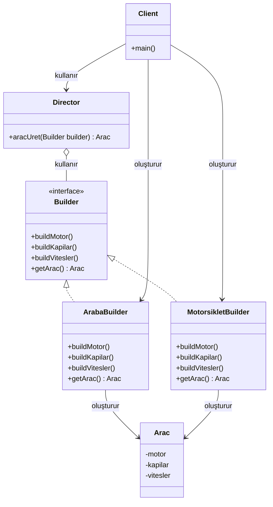

# Builder Design Pattern

## Genel Bakış
Builder deseni, karmaşık nesneleri adım adım oluşturmayı sağlayan bir tasarım kalıbıdır. Bu desen, bir nesnenin farklı sunumlarını aynı oluşturma süreciyle yaratmanıza olanak tanır. Düşünün ki bir ev inşa ediyorsunuz - temel yapı aynı olsa da, farklı odalar, pencereler ve kapılar ekleyerek çeşitli ev tipleri oluşturabilirsiniz.

## Kullanım Alanları
Builder deseni şu durumlarda kullanılır:
- Çok sayıda parametreye sahip karmaşık nesneler oluşturmak gerektiğinde
- Aynı nesnenin farklı versiyonlarını üretmek gerektiğinde
- Nesne oluşturma sürecinin adımlarını kontrol etmek istediğinizde
- Nesne oluşturma kodunu, nesnenin kendisinden ayırmak istediğinizde

Örneğin, bir oyundaki araçlar (araba, motorsiklet, scooter) farklı parçalardan oluşur ama hepsi bir "araç" olarak temsil edilir.

## Uygulama Adımları
1. Ürün sınıfını tanımlayın (Product)
2. Builder arayüzünü oluşturun (temel yapım adımlarını içerir)
3. Farklı ürün tipleri için somut builder sınıfları oluşturun
4. Director sınıfını tanımlayın (yapım sürecini yönetir)
5. Client kodunda, istediğiniz builder'ı seçip director'a verin

## UML Diyagramı

## Avantajlar ve Dezavantajlar

### Avantajlar
1. **Adım adım oluşturma**: Karmaşık nesneleri küçük adımlarla oluşturabilirsiniz.
2. **Kod tekrarını önleme**: Aynı oluşturma kodunu farklı ürünler için tekrar kullanabilirsiniz.
3. **İzolasyon**: Nesne oluşturma mantığı, iş mantığından ayrılır.
4. **Kontrol**: Nesne oluşturma sürecinin her adımını kontrol edebilirsiniz.

### Dezavantajlar
1. **Karmaşıklık**: Basit nesneler için fazla kod gerektirebilir.
2. **Çok sayıda sınıf**: Her yeni ürün için yeni bir builder sınıfı gerektirir.
3. **Bağımlılık**: Client, builder ve director sınıflarını bilmek zorundadır.

Builder deseni, bir çocuğun LEGO parçalarını adım adım birleştirerek farklı modeller oluşturmasına benzer. Temel parçalar (yapım adımları) aynı olsa da, sonuçta ortaya çıkan modeller (ürünler) birbirinden farklı olabilir. Bu sayede karmaşık nesneleri basit adımlarla oluşturabilir ve client kodunu bu karmaşıklıktan koruyabilirsiniz.