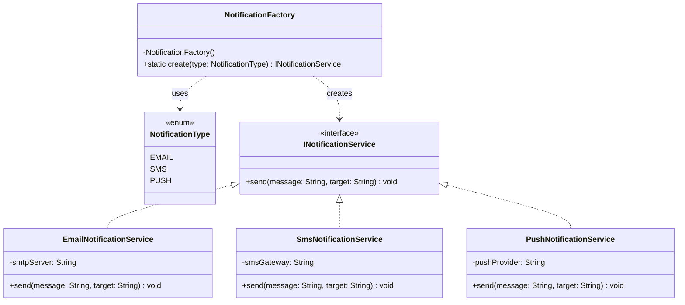

# Factory Method Design Pattern - Enum Tabanlı Örnek

## Genel Bakış
Factory Method tasarım kalıbı , kalıtımsal ilişkileri olan nesnelerin üretilmesi amacıyla kullanılan patternlerden birisidir. Burada asıl olan bir metottur. Bu metodun üstlendiği iş ise istemcinin ihtiyacı olan asıl ürünlerin üretilmesini sağlamak.
Fabrika metodunun özelliği istemciden gelen talebe göre uygun olan ürünün üretilip istemciye verilmesidir. 
Bu Factory Method versiyonunda, ürün tiplerini bir enum ile tanımlayıp, private constructor'a sahip bir Factory sınıfı içinde `public static create(UrunType type)` metodu ile ürün oluşturuyoruz. Bu yaklaşım, daha basit ve merkezi bir nesne yaratma mekanizması sağlar.

## Kullanım Alanları
- Raporlama sistemleri (PDF, Excel, HTML raporları)
- Bildirim servisleri (Email, SMS, Push bildirimleri)
- Ödeme işlemleri (Kredi kartı, Havale, Kapıda ödeme)

## Uygulama Adımları
1. Ürün tipleri için bir enum tanımla
2. Ürünler için ortak bir arayüz tanımla
3. Her ürün bu arayüzü uygulasın
4. Private constructor'a sahip bir Factory sınıfı oluştur
5. Factory içinde `public static create(UrunType type)` metodu tanımla
6. İstemci kod, Factory'nin create metodunu kullanarak ürün oluştursun

## UML Diyagramı - Bildirim Servisi Örneği

## Avantajlar
1. Merkezi nesne yaratma - tek bir noktadan kontrol
2. Enum ile tip güvenliği sağlanır
3. Kolay kullanım - tek bir statik metod çağrısı
4. Nesne yaratma mantığı tek bir yerde toplanır

## Dezavantajlar
1. Yeni bir tip eklemek için Factory sınıfını değiştirmek gerekir (OCP ilkesine aykırı)
2. Singleton gibi davranır, test edilebilirliği azaltabilir
3. Çok karmaşık nesne yaratma senaryoları için yetersiz kalabilir

Bu yaklaşım, özellikle sabit sayıda ve iyi tanımlanmış ürün tipleri olduğunda kullanışlıdır. Enum kullanımı, tip güvenliği sağlar ve yanlış tip gönderme riskini azaltır.

# Factory Method Tasarım Deseni: Bildirim Sistemi Örneği

## Bileşenler

### NotificationType
- Bildirim türlerini tanımlayan bir enum.

### INotificationService
- Tüm bildirim servislerinin uygulaması gereken arayüz.

### Servis Uygulamaları
- **EmailNotificationService**: E-posta bildirimleri için INotificationService arayüzünü uygulayan sınıf.
- **SmsNotificationService**: SMS bildirimleri için INotificationService arayüzünü uygulayan sınıf.
- **PushNotificationService**: Push bildirimleri için INotificationService arayüzünü uygulayan sınıf.

### NotificationFactory
- Bildirim tipine göre uygun bildirim servisini oluşturan fabrika sınıfı.

### NotificationClient
- Factory Method desenini test etmek için örnek bir istemci sınıfı.

## Factory Method Tasarım Deseni Hakkında

Factory Method tasarım deseni, nesne oluşturma mantığını istemci kodundan ayırarak, kodun daha esnek ve genişletilebilir olmasını sağlar. Bu örnekte, istemci kod (NotificationClient) hangi bildirim servisinin nasıl oluşturulduğunu bilmek zorunda kalmadan, sadece NotificationFactory üzerinden istediği türde bir bildirim servisi alabilir.

## Genişletilebilirlik

Yeni bir bildirim türü eklemek istediğimizde:

1. NotificationType enum'ına yeni bir tür ekleriz.
2. INotificationService arayüzünü uygulayan yeni bir sınıf oluştururuz.
3. NotificationFactory sınıfındaki create metoduna yeni bir case ekleriz.

Bu şekilde, mevcut kodu değiştirmeden (Open/Closed Principle) sistemi genişletebiliriz.

## Kullanım

Uygulamayı çalıştırmak için NotificationClient sınıfındaki main metodunu kullanabilirsiniz.