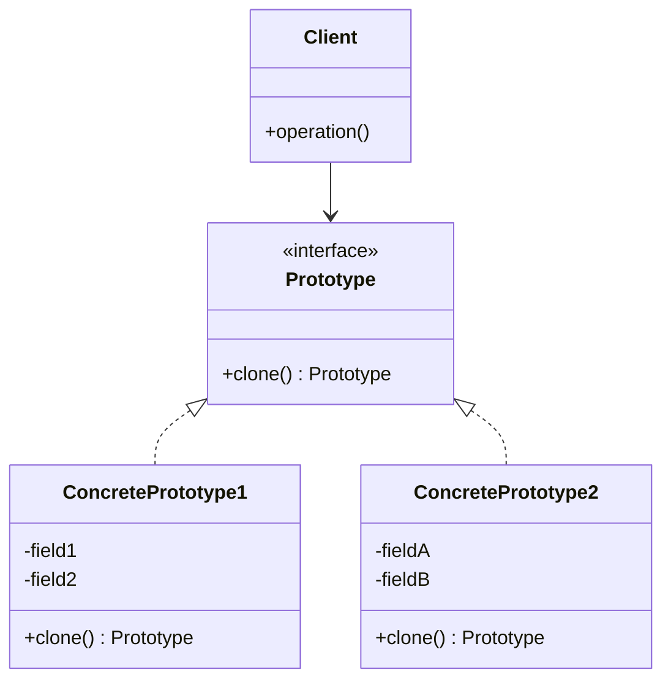

# Prototype Design Pattern

## Genel Bakış
Prototype Design Pattern, var olan bir nesnenin kopyasını oluşturarak yeni nesneler yaratmamızı sağlayan bir tasarım kalıbıdır. Bu kalıp, yeni nesneleri sıfırdan oluşturmak yerine, mevcut bir nesnenin kopyasını alarak oluşturmayı önerir. Tıpkı bir şablondan (prototip) kopya çıkarmak gibi düşünebilirsiniz.

## Kullanım Alanları
- Nesne oluşturmanın maliyetli olduğu durumlar
- Benzer özelliklere sahip çok sayıda nesne oluşturmanız gerektiğinde
- Sistem, nesne oluşturma detaylarından bağımsız olması gerektiğinde
- Çalışma zamanında dinamik olarak nesne oluşturmanız gerektiğinde
- Veritabanından çekilen bilgilerle birden fazla benzer nesne oluşturulacağı zaman

## Uygulama Adımları
1. Klonlanabilir bir arayüz (interface) oluşturun (genellikle `clone()` metodu içerir)
2. Bu arayüzü uygulayan somut sınıflar oluşturun
3. Bu sınıflarda `clone()` metodunu, nesnenin tam bir kopyasını döndürecek şekilde gerçekleştirin
4. İhtiyaç duyulduğunda, yeni nesne oluşturmak yerine var olan nesnenin kopyasını alın

## UML Diyagramı

## Avantajlar
- Karmaşık nesneleri sıfırdan oluşturmak yerine kopyalamak daha hızlıdır
- Yeni nesneleri, sınıflarına bağımlı olmadan oluşturabilirsiniz
- Önceden yapılandırılmış nesnelerin kopyalarını kolayca oluşturabilirsiniz
- Karmaşık nesneleri oluşturmak için gereken kod miktarını azaltır

## Dezavantajlar
- Dairesel referanslar içeren nesneleri klonlamak zor olabilir
- Derin kopyalama (deep copy) işlemi karmaşık olabilir
- Bazı programlama dillerinde klonlama işlemi için ek kod yazmanız gerekebilir
- Çok fazla iç içe geçmiş nesneleri kopyalamak performans sorunlarına yol açabilir

Bu tasarım kalıbı, özellikle nesne oluşturmanın maliyetli olduğu durumlarda çok faydalıdır. Tıpkı bir fotokopi makinesi gibi, elinizdeki bir belgenin kopyasını çıkarmak, aynı belgeyi yeniden yazmaktan çok daha kolay ve hızlıdır.