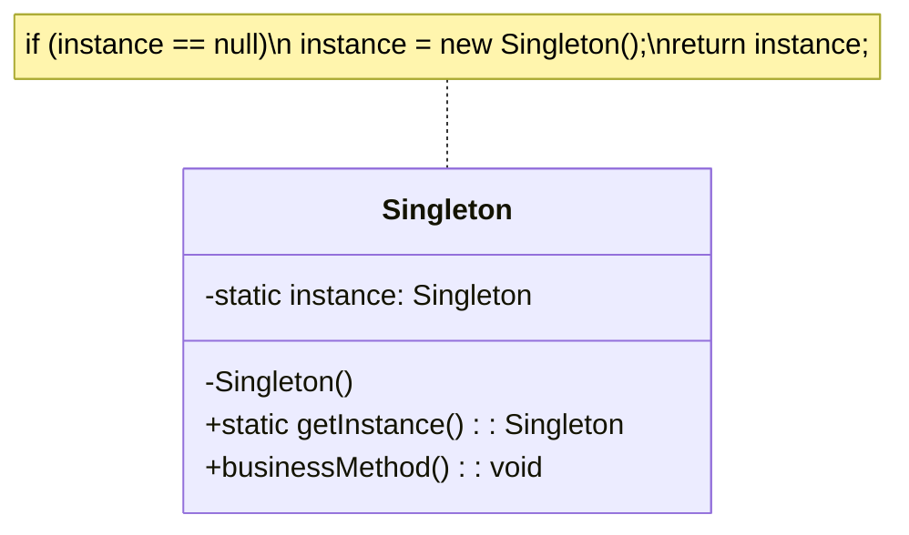

# Singleton Tasarım Deseni

## Genel Bakış
Singleton Design Pattern, bir sınıfın uygulama yaşam döngüsü boyunca **yalnızca bir kez örneklenmesini** ve bu tek örneğe global erişim sağlanmasını garanti eder. Creational (Yaratımsal) tasarım desenleri grubuna aittir.

## Kullanım Alanları
- **Veritabanı bağlantıları**: Tek bir bağlantı nesnesi kullanarak sistem kaynaklarını verimli kullanma
- **Yapılandırma yönetimi**: Uygulama ayarlarının merkezi yönetimi
- **Logger sınıfları**: Tüm uygulama için tek bir log mekanizması
- **Cache yönetimi**: Önbellek verilerinin merkezi yönetimi

## Uygulama Adımları
1. Sınıfın **constructor metodu private** olarak tanımlanır
2. Sınıf içinde **kendi türünden private static bir değişken** tanımlanır
3. Bu değişkene erişim sağlayan **public static bir metot veya property** oluşturulur

## UML Diyagramı

## Avantajlar ve Dezavantajlar
**Avantajlar:**
- Tek bir örnek garantisi
- Global erişim
- Kaynakların verimli kullanımı

**Dezavantajlar:**
- Sıkı bağlantılar oluşturabilir
- Test edilmesi zor olabilir
- Çok iş parçacıklı ortamlarda dikkatli kullanılmalıdır

Singleton deseni basit görünse de, doğru uygulanması ve ihtiyaç duyulduğunda kullanılması önemlidir.