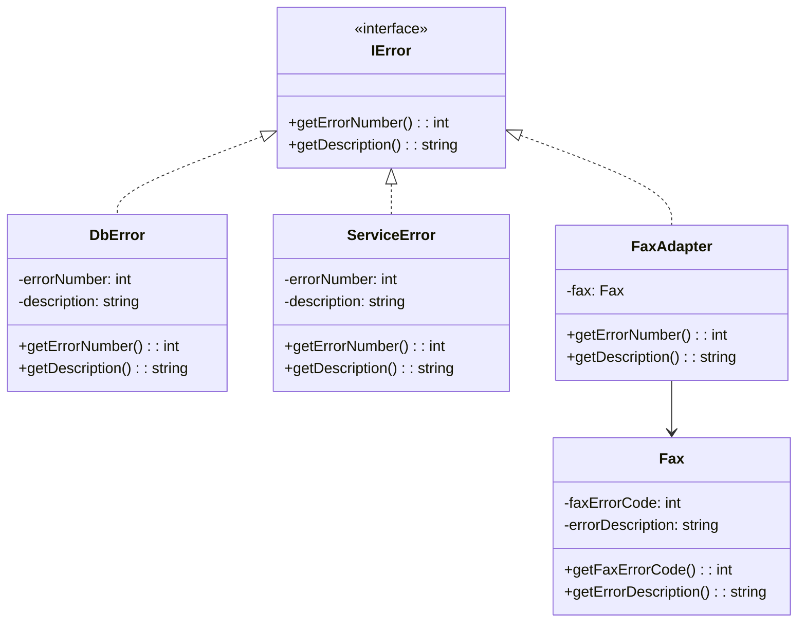

# Adapter Design Pattern

## Genel Bakış
Adapter (Adaptör) tasarım deseni, birbiriyle uyumsuz arayüzlere sahip sınıfların birlikte çalışmasını sağlayan yapısal bir tasarım desenidir. Mevcut bir sınıfı, başka bir arayüz üzerinden kullanılabilir hale getirir.

## Kullanım Alanları
- Eski sistemlerin yeni sistemlerle entegrasyonunda
- Farklı kütüphanelerin uyumlu hale getirilmesinde
- Üçüncü parti servislerin mevcut sisteme entegrasyonunda
- Legacy kod ile yeni kod arasında köprü kurulmasında

## Uygulama Adımları
1. Hedef arayüzü (Target Interface) tanımlama
2. Adapte edilecek sınıfı (Adaptee) belirleme
3. Adapter sınıfını oluşturma ve hedef arayüzü implemente etme
4. Adapter içinde Adaptee nesnesini kullanarak dönüşüm işlemlerini gerçekleştirme

## UML Diyagramı

## Avantajlar
- Uyumsuz sınıfların birlikte çalışmasını sağlar
- Mevcut kodu değiştirmeden yeni özellikler eklemeye olanak tanır
- Kod tekrarını önler
- Single Responsibility prensibine uygunluk sağlar

## Dezavantajlar
- Ekstra sınıflar eklediği için kod karmaşıklığını artırabilir
- Bazen çok sayıda adaptör sınıfı gerekebilir
- Tüm sınıfları adapte etmek her zaman mümkün olmayabilir

Örnek senaryo: Yukarıdaki UML diyagramında gösterilen hata yönetimi sistemi, farklı türdeki hataları (veritabanı, servis ve faks hataları) ortak bir arayüz üzerinden yönetebilmektedir. FaxAdapter sınıfı, farklı yapıdaki Fax sınıfını IError arayüzüne uyumlu hale getirerek sistemle entegre olmasını sağlar.
