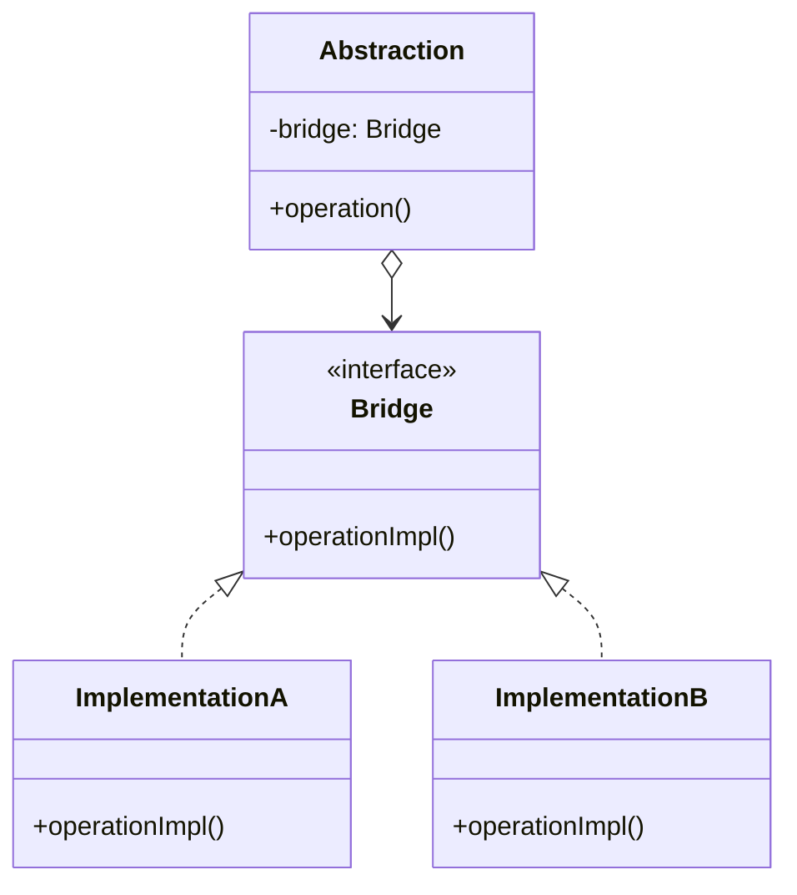
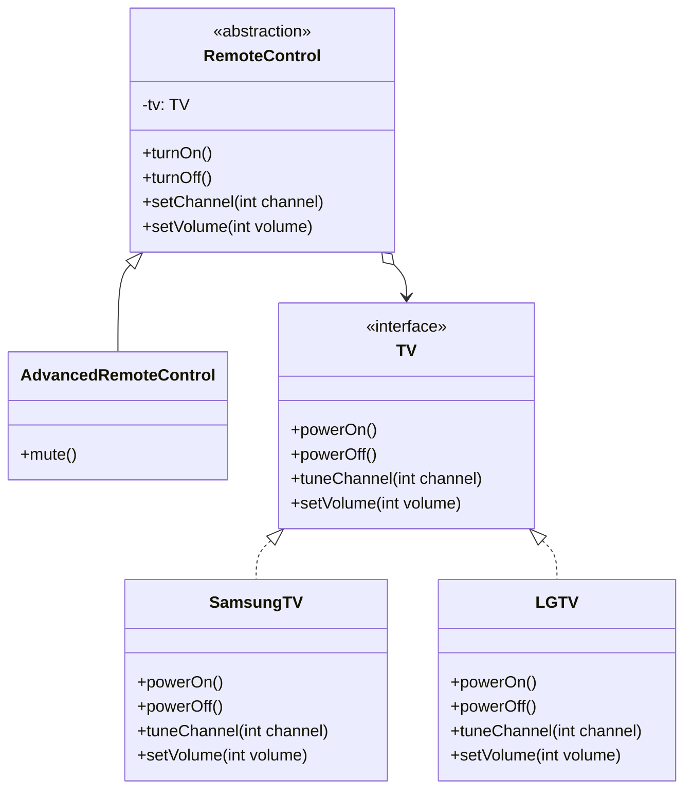

# Bridge Design Pattern

## Genel Bakış
Bridge (Köprü) tasarım deseni, soyutlama (abstraction) ile implementasyonu birbirinden ayırarak, bu iki yapının bağımsız olarak değişebilmesini sağlayan yapısal bir tasarım desenidir.

## Kullanım Alanları
- Soyutlama ve implementasyonun bağımsız olarak değişmesi gerektiğinde
- Çapraz platform uygulamalarında
- Farklı veritabanı sürücüleri implementasyonlarında
- Arayüz (GUI) uygulamalarında platform bağımsız geliştirme yapılırken

## Uygulama Adımları
1. Implementasyon arayüzünü (Bridge) tanımlama
2. Concrete implementasyon sınıflarını oluşturma
3. Abstraction sınıfını tanımlama
4. Bridge arayüzünü Abstraction sınıfına bağlama

## UML Diyagramı

## Avantajlar
- Soyutlama ve implementasyon bağımsız olarak geliştirilebilir
- Tek Sorumluluk İlkesine (SRP) uygunluk
- Açık/Kapalı prensibine uygunluk
- Yeni implementasyonlar kolayca eklenebilir

## Dezavantajlar
- Karmaşık yapılarda kod okunabilirliği azalabilir
- Küçük uygulamalar için fazla yapısal olabilir
- Tasarım karmaşıklığı artabilir

Bu yapıda Abstraction sınıfı, client tarafından kullanılan ana sınıftır ve Bridge interface'i üzerinden farklı implementasyonlara erişim sağlar. Bu sayede implementasyonlar clienttan tamamen soyutlanmış olur ve bağımsız olarak değiştirilebilir.
## Örnek Uygulama
** Tv Kumanda Örneği

