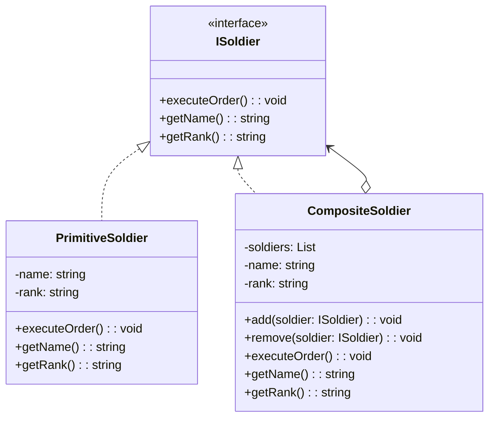

# Composite Design Pattern - Organizasyon Yapısı Örneği

## Genel Bakış
Composite deseni, parça-bütün ilişkisini ağaç yapısında temsil eden ve tekil nesneler ile nesne gruplarının aynı arayüz üzerinden yönetilmesini sağlayan yapısal bir tasarım desenidir.

## Kullanım Alanları
- Hiyerarşik nesne yapılarının temsil edilmesi
- İstemcinin tekil nesneler ve nesne kompozisyonlarını aynı şekilde ele alması gereken durumlar
- Organizasyon şemaları, dosya sistemleri, menü yapıları gibi ağaç yapısındaki sistemler

## Uygulama Adımları
1. Component arayüzünün tanımlanması
2. Leaf (yaprak) sınıflarının oluşturulması
3. Composite sınıfının oluşturulması
4. İstemci kodunun yazılması

## UML Diyagramı

## Avantajlar
- Karmaşık ağaç yapılarının kolay yönetimi
- Tek bir arayüz üzerinden hem tekil hem kompozit nesnelerin yönetimi
- Yeni bileşen türlerinin kolayca eklenmesi
- Open/Closed prensibine uygunluk

## Dezavantajlar
- Ortak arayüz tasarımının zorluğu
- Bileşen hiyerarşisinin çok derinleşebilmesi
- Güvenlik kısıtlamalarının yönetiminin zorluğu

Bu örnekte, bir askeri organizasyon yapısı modellenmiştir. Tek bir asker (PrimitiveSoldier) ve bir birlik (CompositeSoldier) aynı arayüzü (ISoldier) kullanarak emirleri işleyebilir. Bu sayede hem tekil askerler hem de birlikler aynı şekilde yönetilebilir.