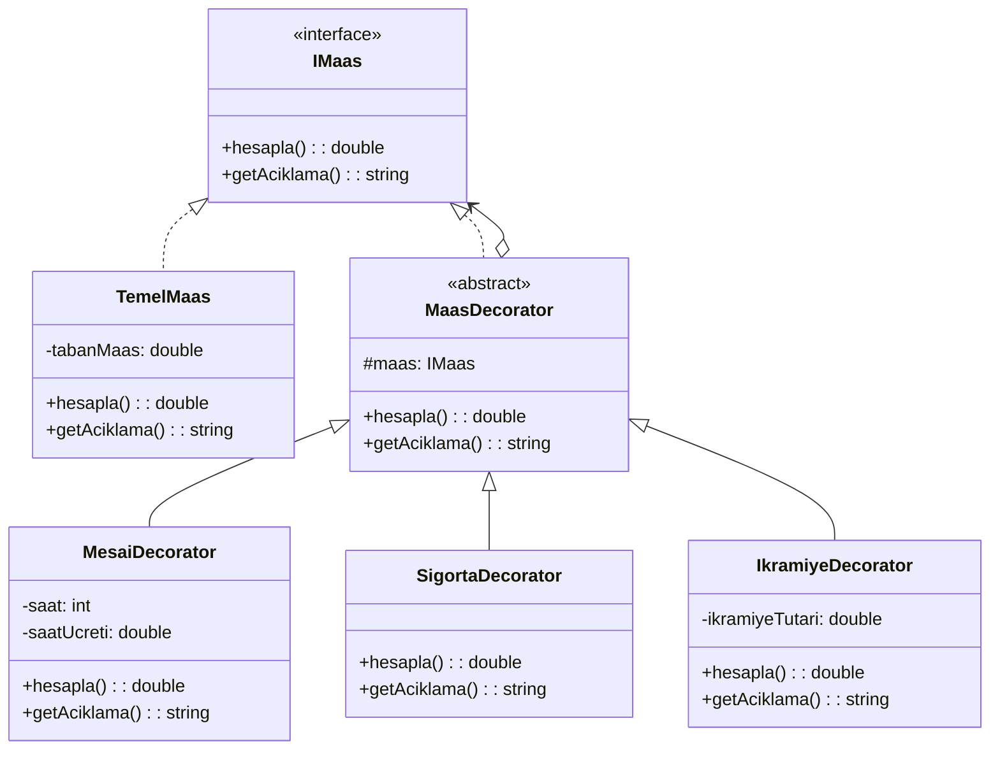

# Decorator Design Pattern - Maaş Hesaplama Örneği

## Genel Bakış
Decorator deseni, nesnelere çalışma zamanında dinamik olarak yeni özellikler ve davranışlar eklemeyi sağlayan yapısal bir tasarım desenidir. Bu desen, kalıtım yerine sarmalama yöntemini kullanarak nesneleri genişletir.

## Kullanım Alanları
- Nesnelere dinamik olarak yeni özellikler eklenmesi gereken durumlar
- Alt sınıf oluşturmanın pratik olmadığı durumlar
- Nesne davranışlarının çalışma zamanında değişmesi gereken durumlar
- Ana sınıfı değiştirmeden yeni işlevsellik eklenmesi gereken durumlar

## Uygulama Adımları
1. Temel arayüzün tanımlanması (IMaas)
2. Ana bileşenin oluşturulması (TemelMaas)
3. Soyut decorator sınıfının oluşturulması (MaasDecorator)
4. Somut decorator sınıflarının oluşturulması (MesaiDecorator, SigortaDecorator vb.)

## UML Diyagramı

## Avantajlar
- Esnek ve dinamik özellik ekleme imkanı
- Tek Sorumluluk İlkesine uygunluk
- Mevcut kodu değiştirmeden yeni özellikler ekleme
- İstenilen kombinasyonlarda özellik kullanımı

## Dezavantajlar
- Çok sayıda küçük sınıf oluşması
- Decorator sıralamasının önemli olması
- Karmaşık yapılarda bakımın zorlaşması

Bu örnekte, taban maaş üzerine mesai ücreti, ikramiye ve SGK kesintisi gibi farklı bileşenler decorator pattern kullanılarak eklenmiştir. Her bir decorator, maaş hesaplamasına kendi mantığını ekler ve diğer decorator'lardan bağımsız çalışır.