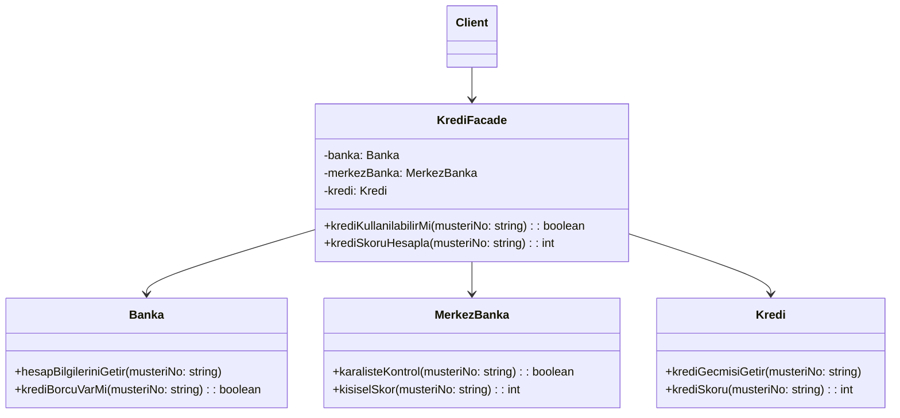

# Facade Design Pattern

## Genel Bakış
Facade (Cephe) tasarım deseni, karmaşık alt sistemlerin kullanımını basitleştirmek için tek bir arayüz sağlayan yapısal (structural) bir tasarım desenidir. Alt sistemlerin karmaşıklığını gizleyerek, istemcilere basit bir arayüz sunar.

## Kullanım Alanları
- Karmaşık kütüphanelerin ve API'ların basitleştirilmesi
- Çok katmanlı sistemlerde katmanlar arası iletişim
- Legacy (eski) sistemlerin modern sistemlere entegrasyonu
- Bağımlılıkların azaltılması gereken durumlarda

## Uygulama Adımları
1. Karmaşık alt sistem sınıflarını tanımlama
2. Facade sınıfı oluşturma
3. Alt sistem işlemlerini Facade sınıfında birleştirme
4. İstemci kodunu Facade arayüzünü kullanacak şekilde düzenleme

## UML Diyagramı

## Avantajlar
- Alt sistemlerin karmaşıklığını gizler
- Gevşek bağlılık sağlar
- Kodun okunabilirliğini artırır
- Bakımı kolaylaştırır

## Dezavantajlar
- Facade sınıfı tek sorumluluk prensibini ihlal edebilir
- Zamanla "god object" (her şeyi bilen nesne) haline gelebilir
- Alt sistemlere doğrudan erişim gerektiğinde esnekliği kısıtlayabilir

Bu desen özellikle büyük ve karmaşık sistemlerde, alt sistemlerin kullanımını basitleştirmek için tercih edilir. Örneğin, bir banka uygulamasında kredi başvuru işlemlerini basitleştirmek için kullanılabilir.
Banka kredisi örneği üzerinden Facade Design Pattern'i gösteren güncellenmiş UML diyagramı:

## Örnek Uygulama

1. **KrediFacade**: Ana Facade sınıfı. Karmaşık kredi kontrol sürecini basit bir arayüz üzerinden sunar.
    - `krediKullanilabilirMi()`: Müşterinin kredi kullanıp kullanamayacağını kontrol eder
    - `krediSkoruHesapla()`: Müşterinin kredi skorunu hesaplar

2. **Alt Sistemler**:
    - **Banka**: Müşterinin banka hesap bilgilerini ve mevcut kredi borçlarını kontrol eder
    - **MerkezBanka**: Kara liste kontrolü ve merkezi kredi skoru hesaplama işlemlerini yapar
    - **Kredi**: Müşterinin kredi geçmişi ve kredi skoru hesaplama işlemlerini yürütür

3. **Client**: Sadece KrediFacade ile etkileşime girer, alt sistemlerin karmaşıklığından izole edilmiştir.

Bu yapı, karmaşık kredi değerlendirme sürecini basit bir arayüz üzerinden sunarak, istemcinin alt sistemlerin detaylarıyla uğraşmasını önler.