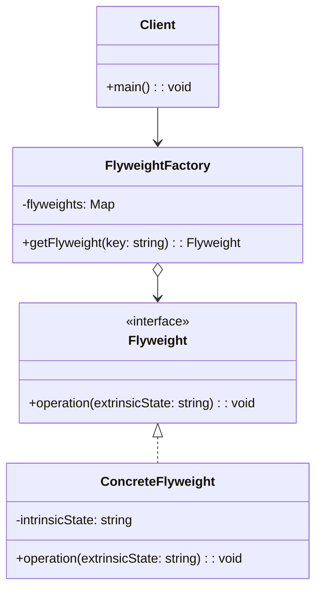
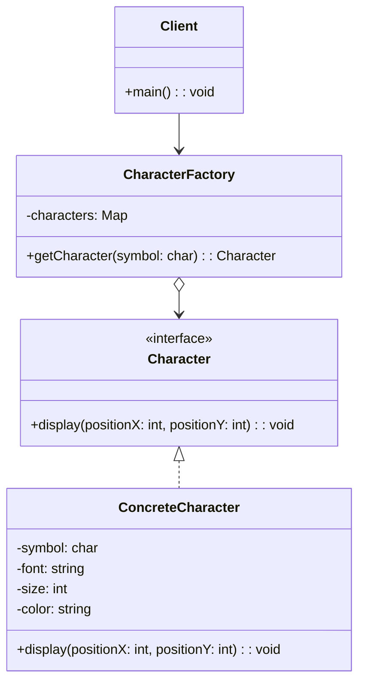

# Flyweight Design Pattern

## Genel Bakış
Flyweight tasarım deseni, bellek kullanımını optimize etmek için aynı türden çok sayıda nesnenin tekrar tekrar oluşturulmasını önler. Bu desen, nesneleri bir havuzda saklar ve ortak özelliklere sahip nesneleri paylaşarak bellek tüketimini azaltır.

## Kullanım Alanları
- Çok sayıda benzer nesnenin oluşturulması gerektiğinde
- Bellek kullanımının kritik olduğu durumlarda
- Nesnelerin bazı özelliklerinin ortak (intrinsic), bazılarının ise değişken (extrinsic) olduğu durumlarda
- Grafik uygulamaları (örneğin, oyunlarda aynı türden birçok obje), metin işleme (aynı harflerin tekrar kullanılması)

## Uygulama Adımları
1. **Flyweight Arayüzü**: Ortak davranışları tanımlar.
2. **ConcreteFlyweight**: Paylaşılan (intrinsic) özellikleri tanımlayan sınıf.
3. **FlyweightFactory**: Nesneleri havuzda saklar ve tekrar kullanılabilir nesneleri sağlar.
4. **Client**: FlyweightFactory üzerinden nesneleri alır ve gerekirse extrinsic özellikleri ayarlar.

## UML Diyagramı

## Avantajlar
- **Bellek tasarrufu**: Aynı özelliklere sahip nesneler paylaşılır, gereksiz nesne üretimi önlenir.
- **Performans artışı**: Daha az bellek kullanımı ve nesne yönetimi sayesinde performans iyileşir.
- **Ortak özelliklerin yönetimi**: Intrinsic özellikler merkezi bir yerde tutulur ve yönetilir.

## Dezavantajlar
- **Karmaşık yapı**: Havuz yönetimi ve intrinsic/extrinsic ayrımı ek bir karmaşıklık getirir.
- **Ekstra bellek kullanımı**: Havuzun kendisi bir miktar bellek tüketir.
- **Esneklik kaybı**: Paylaşılan nesneler tüm istemciler için aynı özelliklere sahip olmalıdır; bu, özelleştirme gereksinimlerini sınırlayabilir.

Flyweight deseni, özellikle çok sayıda nesnenin aynı anda yönetildiği durumlarda bellek ve performans optimizasyonu sağlamak için etkili bir çözümdür.
## Örnek Uygulama
Flyweight tasarım desenini en iyi anlatan örneklerden biri **"Karakterlerin (Harflerin) Metin İşleme Uygulamalarında Tekrar Kullanılması"**dır.

### Örnek: **Metin İşleme (Text Editor)**
Bir metin düzenleyici düşünelim. Bu düzenleyicide aynı karakterler (örneğin "A", "B", "C") birden fazla yerde kullanılabilir. Flyweight deseni sayesinde, her karakter için yeni bir nesne oluşturmak yerine, aynı karakter nesnesi tekrar tekrar kullanılır. Karakterlerin **font, renk, boyut gibi ortak özellikleri (intrinsic)** Flyweight nesnesinde tutulurken, karakterin **konumu (extrinsic)** gibi değişken özellikleri istemci tarafından belirlenir.

---

### UML Diyagramı

---

### Açıklama
1. **Character (Flyweight Arayüzü)**: Karakterlerin ortak davranışlarını tanımlar. Örneğin, bir karakterin ekranda belirli bir pozisyonda görüntülenmesi için `display()` metodu.
2. **ConcreteCharacter (Flyweight)**: Paylaşılan (intrinsic) özellikleri içerir. Örneğin, `symbol`, `font`, `size`, ve `color` gibi özellikler.
3. **CharacterFactory (FlyweightFactory)**: Karakter nesnelerini havuzda tutar ve tekrar kullanılabilir nesneleri sağlar. Örneğin, "A" karakteri bir kez oluşturulur ve tüm istemciler için paylaşılır.
4. **Client**: FlyweightFactory üzerinden karakter nesnelerini alır ve konum gibi extrinsic özellikleri belirler.

---

### Özet
Bu örnek, Flyweight deseninin nasıl çalıştığını somut bir şekilde gösterir. Metin düzenleyicilerde aynı karakterlerin tekrar tekrar kullanılması gerektiğinde Flyweight deseni, bellek tasarrufu ve performans artışı sağlar. Örneğin, bir metin belgesinde 1000 defa "A" harfi varsa, Flyweight sayesinde yalnızca bir "A" nesnesi oluşturulur ve 1000 farklı konum için kullanılır.