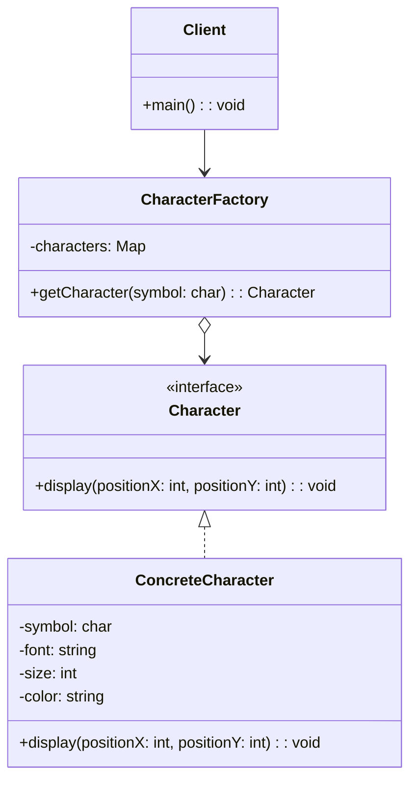

# Flyweight Tasarım Deseni

## Amaç
Flyweight (Hafif Nesne) tasarım deseni, çok sayıda benzer nesnenin verimli bir şekilde kullanılmasını sağlayan yapısal bir tasarım desenidir. Bu desen, nesnelerin ortak durumlarını paylaşarak bellek kullanımını azaltır.

## Kullanım Senaryoları
- Çok sayıda benzer nesne oluşturulması gerektiğinde
- Bellek kullanımının kritik olduğu durumlarda
- Nesnelerin durumlarının büyük bir kısmının paylaşılabilir olduğu durumlarda
- Nesne kimliğinin önemli olmadığı durumlarda

## UML Diyagramı


## Bileşenler

### Character (Flyweight Interface)
- Flyweight nesnelerinin uygulaması gereken metodu tanımlar
- Bu örnekte, karakterlerin belirli bir konumda gösterilmesini sağlayan `display` metodu

### ConcreteCharacter (Concrete Flyweight)
- Character arayüzünü uygular
- İçsel durum (intrinsic state) bilgilerini içerir: sembol, yazı tipi, boyut, renk
- Bu bilgiler tüm kullanım bağlamlarında paylaşılır

### CharacterFactory (Flyweight Factory)
- Flyweight nesnelerini oluşturur ve yönetir
- Daha önce oluşturulan nesneleri önbelleğe alır ve gerektiğinde yeniden kullanır
- Gereksiz nesne oluşturulmasını önler

### Client
- Flyweight desenini kullanan istemci kodu
- Dışsal durum (extrinsic state) bilgilerini (konum) flyweight nesnelerine iletir

## Çalışma Prensibi
1. İstemci, CharacterFactory'den bir karakter nesnesi ister
2. Factory, istenen karakter daha önce oluşturulmuşsa onu döndürür, oluşturulmamışsa yeni bir nesne oluşturur
3. İstemci, karakterin konumunu (dışsal durum) belirterek display metodunu çağırır
4. Aynı karakter farklı konumlarda gösterilse bile, tek bir nesne kullanılır

## Avantajları
- Bellek kullanımını azaltır
- Performansı artırır
- Nesne sayısını azaltır

## Dezavantajları
- Kod karmaşıklığını artırabilir
- Dışsal durumun yönetilmesi gerekir
- Bazı durumlarda performans düşebilir

## Örnek Çıktı
```
Displaying text: "Hello Flyweight Pattern!"
------------------------------
Creating new character: 'H'
Character 'H' displayed at position (0, 20) with font 'Arial', size 12, and color 'Black'
Creating new character: 'e'
Character 'e' displayed at position (10, 20) with font 'Arial', size 12, and color 'Black'
Creating new character: 'l'
Character 'l' displayed at position (20, 20) with font 'Arial', size 12, and color 'Black'
Reusing existing character: 'l'
Character 'l' displayed at position (30, 20) with font 'Arial', size 12, and color 'Black'
Creating new character: 'o'
Character 'o' displayed at position (40, 20) with font 'Arial', size 12, and color 'Black'
Creating new character: ' '
Character ' ' displayed at position (50, 20) with font 'Arial', size 12, and color 'Black'
Creating new character: 'F'
Character 'F' displayed at position (60, 20) with font 'Arial', size 12, and color 'Black'
...
------------------------------
Total unique characters created: 14
Total characters in text: 24
Memory saved: 10 character objects
```