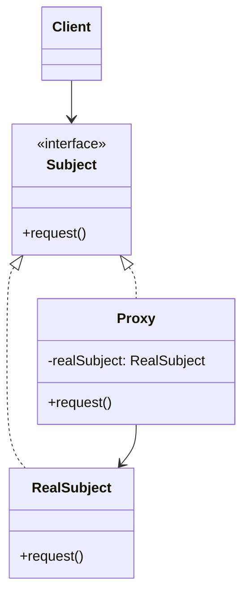
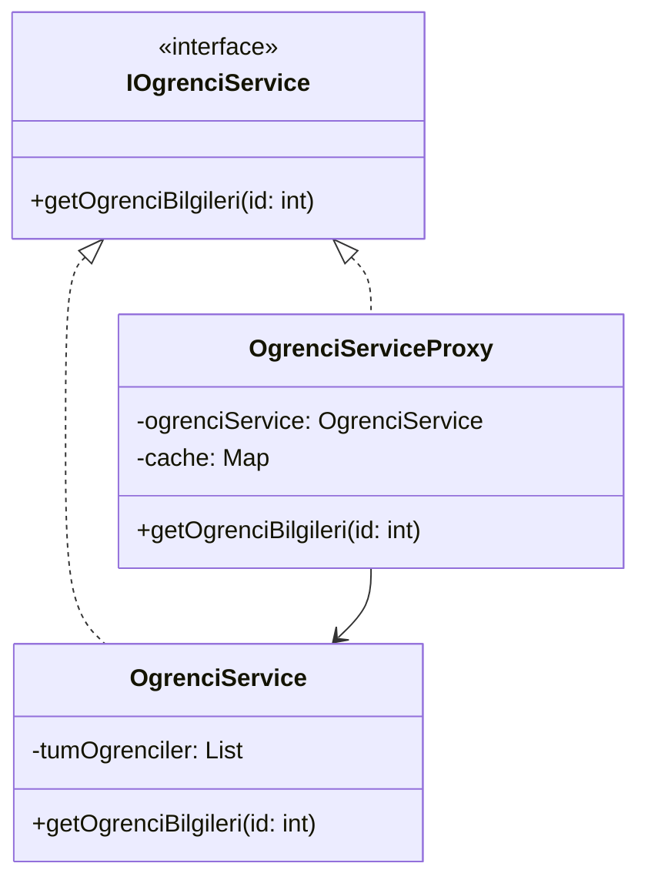

# Proxy Design Pattern

## Genel Bakış
Proxy (Vekil) tasarım deseni, bir nesneye erişimi kontrol etmek için o nesnenin yerine geçebilen bir vekil nesne kullanma mantığına dayanan yapısal bir tasarım desenidir. Asıl nesnenin yerine geçerek, istemci ile asıl nesne arasında bir aracı görevi görür.

## Kullanım Alanları
- Büyük boyutlu nesnelerin lazy loading (geç yükleme) işlemleri
- Uzak sunucu bağlantılarında (Remote Proxy)
- Erişim kontrolü gerektiren durumlarda (Protection Proxy)
- Cache mekanizması gereken durumlarda (Cache Proxy)
- Loglama ve izleme gerektiren işlemlerde

## Uygulama Adımları
1. Asıl nesne ve proxy için ortak bir arayüz tanımlama
2. Asıl nesneyi (RealSubject) oluşturma
3. Proxy sınıfını oluşturma ve asıl nesneye referans verme
4. Proxy üzerinden gerekli kontrol ve yönlendirmeleri yapma

## UML Diyagramı

## Avantajlar
- Asıl nesneye erişimi kontrol eder
- Güvenlik katmanı sağlar
- Performans optimizasyonu sağlar
- Lazy loading imkanı sunar
- Asıl nesnenin kullanımını optimize eder

## Dezavantajlar
- Ekstra bir katman eklediği için yanıt süresini artırabilir
- Kodun karmaşıklığını artırabilir
- Bazı durumlarda gereksiz proxy oluşturulabilir

Örnek senaryo: Bir okul yönetim sisteminde, tüm öğrenci bilgilerini içeren büyük bir nesne yerine, sadece ihtiyaç duyulan öğrenci bilgilerine erişim sağlayan bir proxy kullanılabilir. Bu sayede sistem kaynakları daha verimli kullanılır ve gereksiz veri yüklemelerinin önüne geçilir.

proxy, gerçek servise erişimi kontrol eder, cache mekanizması sağlar ve sadece gerekli durumlarda asıl servisi çağırır.